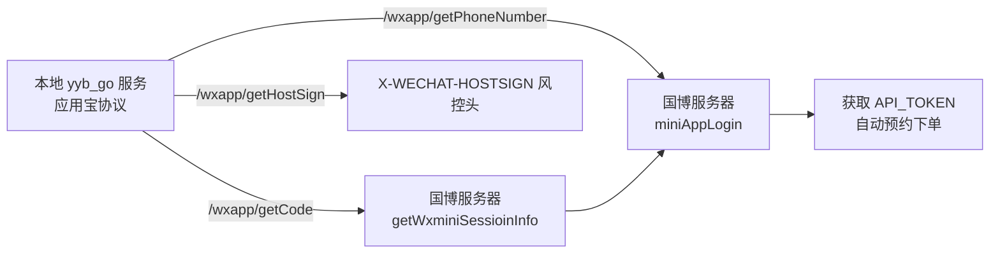

# 国博小程序自动预约客户端

## 项目概述

本项目是一个完整的中国国家博物馆（国博）微信小程序**逆向工程**成果，实现了余票监控、自动验证码识别与自动预约下单的全流程自动化。核心代码均通过对小程序抓包、协议还原、加解密分析与深度学习模型训练获得。

## 登录依赖：应用宝协议服务（yyb_go）

本项目的登录链路**依赖另一套逆向成果**：[luotron/yyb_go](https://github.com/luotron/yyb_go)（应用宝协议本地账号服务）。微信小程序登录需要真实的微信会话（`code` / `encryptedData` / `iv` / `host_sign`），这些数据无法凭空生成，必须由本地运行的应用宝协议服务通过真实微信协议会话提供。



**yyb_go 提供的核心能力：**

| 接口 | 作用 |
| --- | --- |
| `/qr` 系列 | 扫码录入微信账号，本地 SQLite 账号池管理 |
| `/accounts` | 账号列表 / 存活刷新，`expired` 账号自动剔除 |
| `/wxapp/getCode` | 通过本地协议会话换取微信登录 `code`（登录第一步） |
| `/wxapp/getPhoneNumber` | 获取手机号 `encryptedData` / `iv`（登录第二步） |
| `/wxapp/getHostSign` | 本地 WMPF 会话调用微信 `verifyPlugin`，生成 `X-WECHAT-HOSTSIGN` 风控请求头所需签名 |
| `/wxapp/operateWxData` | 运行时风控凭据（TDID 相关）获取 |

**使用前置条件：**

1. 先启动 yyb_go 本地服务（`yyb-go.exe`，默认监听 `http://127.0.0.1:8000`），扫码录入可用微信账号
2. 在 `config.py` 中配置服务地址（默认 `LOCAL_BASE_URL = "https://www.luotronserver.xyz:8000"`）
3. 运行 `python main.py`，`login.py` 会先校验 `/health` → 刷新账号存活 → 逐个账号走两段式登录 → 缓存 `apiToken` 到 `cache/login/`

> 没有 yyb_go 服务，本项目无法登录，也就无法抢票。yyb_go 源码与接口文档见 [github.com/luotron/yyb_go](https://github.com/luotron/yyb_go)。

## 技术价值：解决了什么问题

国博门票每日限量放票，热门场次**秒空**，人工手动抢票基本不可能成功。传统自动化方案的三大痛点，本项目均已攻克：

| 痛点 | 传统方案 | 本项目方案 |
| --- | --- | --- |
| 协议黑盒 | 浏览器/UI 自动化，速度慢、易被风控 | 完整还原小程序 HTTP 协议，直接请求接口，毫秒级响应 |
| 极验验证码 | 人工点选，速度慢且无法 24 小时值守 | 基于 ONNX 深度学习模型本地识别 GeeTest v4 滑块/点选验证码，自动提交 |
| 登录与风控 | 依赖手机模拟，token 易失效 | 逆向还原两段式小程序登录、deviceToken(TDID) 生成、AES 加解密，运行时风控凭据自动刷新 |

### 核心技术栈

- **协议逆向**：抓包还原国博小程序全部预约接口（登录、余票、下单、实名校验），直连 `uu.chnmuseum.cn` / `wxmini.chnmuseum.cn` / `wapticket.chnmuseum.cn`
- **加解密分析**：还原 AES 加密逻辑（`utils/aes.py`）、TDID 设备指纹生成（`utils/tdid.py`）
- **验证码自动识别**：自训练 ONNX 模型（`datu.onnx` / `xiaotu.onnx` / `resnet50_embed.onnx`），本地 FastAPI 服务推理，支持自动启动/清理
- **风控对抗**：极验 GeeTest v4 load 流程、运行时风控凭据（hostSign / pluginCode）动态获取
- **全自动值守**：监控余票 → 自动识别验证码 → 自动下单 → 自动重试，7×24 小时无人值守

## 功能特性

- ✅ 自动监控国博余票，放票即时感知
- ✅ 自动验证码识别（本地 ONNX 模型，无需第三方打码平台）
- ✅ 手动验证码模式兜底（图形界面点选）
- ✅ 本地模型API服务自动启动、自动清理
- ✅ 两段式小程序登录、Token 自动回填
- ✅ 自动保存验证码图片，便于模型迭代
- ✅ 命令行参数配置，可脚本化部署

## 安装依赖

```bash
# 安装所有依赖
pip install -r requirements.txt

# 如果只需要主程序功能（不使用本地模型API）
pip install cycronet Pillow requests
```

## 使用方法

### 0. 启动应用宝协议服务（必需）

登录依赖 [yyb_go](https://github.com/luotron/yyb_go) 本地服务。先启动 `yyb-go.exe`（默认 `http://127.0.0.1:8000`），扫码录入至少一个微信账号，确认 `GET /health` 返回正常。

### 1. 自动启动本地模型API服务（推荐）

项目支持自动启动本地模型API服务。当使用自动识别模式时，如果检测到服务未运行，会自动在后台启动服务：

```bash
# 自动识别模式会自动启动服务
python main.py
```

服务将在 `http://127.0.0.1:8000` 启动，提供验证码识别API。服务只会在第一次需要时启动，程序退出时会自动停止。

### 2. 手动启动本地模型API服务（可选）

如果需要手动控制服务，也可以手动启动：

```bash
cd captcha
python app.py
```

### 3. 运行主程序

```bash
python main.py
```

## 项目结构

```
museum/
├── main.py                    # 主程序入口
├── requirements.txt           # 项目依赖
├── README.md                  # 项目说明
├── config.py                  # 配置文件
├── api.py                     # API接口封装
├── captcha/                   # 验证码相关
│   ├── app.py                # 本地模型API服务
│   ├── models/               # ONNX模型文件
│   └── 国博验证码API调用.md   # API文档
└── utils/                    # 工具模块
    ├── aes.py               # AES加密工具
    ├── captcha.py           # 手动验证码点选
    ├── captcha_auto.py      # 自动验证码识别（支持自动启动服务）
    └── tdid.py              # deviceToken生成
```

## 验证码识别流程

### 自动识别模式（推荐）
1. 检测本地模型API服务是否运行
2. 如果服务未运行，自动在后台启动服务
3. 获取验证码图片（originalImageBase64 和 jigsawImageBase64）
4. 调用本地模型API (`http://127.0.0.1:8000/CNM`)
5. API返回目标中心点坐标
6. 自动计算像素坐标并提交
7. 程序退出时自动停止服务

### 手动识别模式
1. 获取验证码图片
2. 弹出图形界面窗口
3. 用户手动点选目标图案
4. 获取点选坐标并提交

## 配置说明

### 1. API Token配置
编辑 `config.py` 文件，设置有效的 `API_TOKEN`：

```python
API_TOKEN = "你的API_TOKEN"
```

### 2. 实名信息配置
编辑 `config.py` 文件，设置下单实名信息：

```python
ORDER_USER_NAME = "你的姓名"
ORDER_CERT_INFO = "你的身份证号"
```

## 注意事项

1. **API Token有效期**：API Token有有效期限制，过期后需要重新获取
2. **验证码识别准确率**：自动识别依赖于本地模型，准确率可能不是100%
3. **网络连接**：需要稳定的网络连接访问国博API
4. **自动启动服务**：自动识别模式会自动启动服务，无需手动操作
5. **服务端口**：默认使用8000端口，如果端口被占用会自动失败

## 故障排除

### 1. 自动启动服务失败
- 检查是否安装了所有依赖：`pip install -r requirements.txt`
- 检查8000端口是否被占用：`netstat -ano | findstr :8000`
- 检查模型文件是否存在：`captcha/models/datu.onnx` 和 `captcha/models/xiaotu.onnx`
- 可以切换到手动模式：`python main.py --mode manual`

### 2. 自动识别失败
- 检查本地模型API是否正常运行
- 检查验证码图片是否完整获取
- 可以切换到手动模式：`python main.py --mode manual`

### 3. 依赖安装失败
- 使用Python 3.8+版本
- 尝试使用虚拟环境：`python -m venv venv`
- 对于Windows用户，可能需要安装Visual C++ Build Tools

## 更新日志

### v2.0 新增功能
- ✅ 自动启动本地模型API服务
- ✅ 服务只启动一次，避免重复启动
- ✅ 程序退出时自动清理服务
- ✅ 简化的API检测逻辑

## 咨询与联系

本项目涉及小程序逆向、协议还原、加解密分析、极验验证码识别与自动化下单等完整技术链路。如需以下服务，欢迎联系（**付费咨询**）：

- 部署本项目 / 定制抢票需求（含 [yyb_go 应用宝协议服务](https://github.com/luotron/yyb_go) 部署）
- 其他小程序、App 的协议逆向与接口还原
- 验证码（GeeTest v4 等）模型训练与识别方案
- 风控对抗、设备指纹、登录协议等技术咨询

**联系方式：**

| 渠道 | 账号 |
| --- | --- |
| 微信 | `__int64` |
| QQ | `1415662711` |
| Telegram | [@luotron](https://t.me/luotron) |

> 添加时请备注来意（如「国博预约」）。

## 许可证

本项目仅供学习交流使用，请遵守相关法律法规，勿用于非法用途。